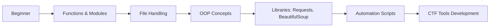
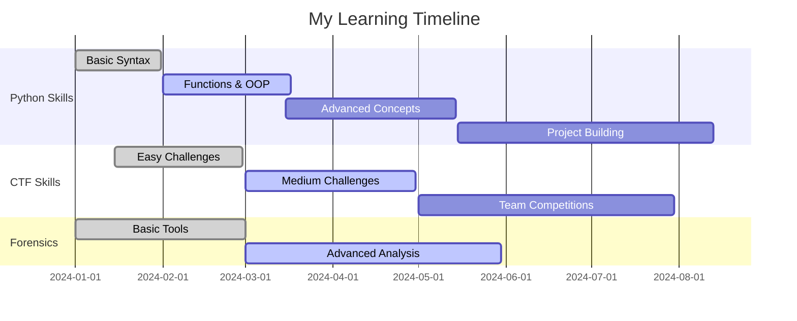

```markdown
# 💻 Klein Ric Abong (muffy)

```
🎓 Computer Science Student | 🔐 CTF Enthusiast | 🕵️ Forensics Lover | 🐍 Python Learner | ❤️ Erica's Biggest Fan
```

---

## 👨‍💻 About Me

```python
class AboutKlein:
    def __init__(self):
        self.name = "Klein Ric M. Abong"
        self.role = "Computer Science Student"
        self.status = "Forever Curious Explorer"
        self.passion = "Technology & Digital Forensics"
        self.heart = "❤️ Erica Joy Lim"
        self.mood = "Always Learning"
        
    def current_focus(self):
        return {
            "learning": "Python (Beginner → Intermediate)",
            "activities": ["CTF Competitions", "Digital Forensics", "Tech Exploration"],
            "projects": "Building cybersecurity tools",
            "goal": "Become a cybersecurity professional"
        }
        
    def daily_routine(self):
        return "Code → Learn → CTF → Repeat 💻"
        
me = AboutKlein()
print(f"Hello World! I'm {me.name}")
print(f"Passionate about: {me.passion}")
print(f"Currently: {me.current_focus()['learning']}")
```

---

## 🛠️ Tech Stack & Skills

### **🌱 Currently Mastering**


### **🔍 Actively Exploring**


### **📚 Want to Learn**


---

## 📊 CTF Analytics

<div align="center">
  


Hack4Gov Trophy


</div>

---

## 🎯 Learning Roadmap

### **🐍 Python Journey**


### **🔐 Cybersecurity Path**
| Level | Status | Focus Areas |
|-------|--------|-------------|
| 🟢 **Level 1** | Completed | Basic Concepts, Network Fundamentals |
| 🟡 **Level 2** | In Progress | Python for Security, Basic CTFs |
| ⚪ **Level 3** | Up Next | Advanced Forensics, Tool Development |
| ⚪ **Level 4** | Future | Red/Blue Team Skills, Certifications |

---

## 🏆 CTF Dashboard

```markdown
## 🎮 Active Platforms
• TryHackMe
• picoCTF
• CTFTime: 1mpv!$3

## 🏅 Recent Achievements
✓ Completed Python basics
✓ Solved first 10 picoCTF challenges
✓ Learned basic forensics tools
✓ Built first automation script

## 🎯 Next Targets
• Top 100 in a CTF competition
• Create a custom CTF tool
• Write CTF writeups
• Contribute to security projects
```

---

## 💝 Personal Corner

<div align="center">

### ❤️ For My Inspiration

> "Behind every line of code I write, there's a beautiful smile cheering me on.  
> Thank you, Erica Joy Lim, for being my motivation and happiness! 💖"


</div>

---

### **🔧 Python Projects (Coming Soon)**
```markdown
├── 📁 CTF-Tools/
│   ├── cipher-decoder.py
│   ├── hash-cracker.py
│   └── network-scanner.py
├── 📁 Forensics-Tools/
│   ├── file-carver.py
│   └── metadata-extractor.py
└── 📁 Learning-Projects/
    ├── automation-scripts/
    └── security-scanners/
```


---

## 🗓️ Daily Coding Activity

```text
🌅 Morning (8 AM - 12 PM)
├── Python Practice (2 hours)
└── CTF Challenges (1 hour)

🌞 Afternoon (1 PM - 5 PM)
├── Coursework (2 hours)
└── Project Work (2 hours)

🌙 Evening (7 PM - 10 PM)
├── Forensics Learning (1 hour)
└── Reading & Documentation (2 hours)
```

---

## 📚 Learning Resources

### **Python & Security**
- [Automate the Boring Stuff with Python](https://automatetheboringstuff.com/)
- [Python for Cybersecurity](https://www.cybrary.it/course/python/)
- [CTF Field Guide](https://trailofbits.github.io/ctf/)

### **Platforms I Use**
[](https://tryhackme.com)
[](https://hackthebox.com)
[](https://picoctf.org)

---

## 🤝 Let's Connect & Collaborate!

<div align="center">

[](mailto:muffeia.klein@gmail.com)
[](https://www.linkedin.com/in/klyjj)
[](https://discord.com/users/yourid)

</div>

---

## 📈 Weekly Progress



---

## 🎮 Fun Section

### **Current CTF Streak** 🔥
```text
Day 1: ✅ | Day 2: ✅ | Day 3: ✅ | Day 4: ✅ | Day 5: ⏳
```

### **Python Lines Written This Month**
```text
[██████████░░░░░░░░] 500/1000 lines
```

### **My Coding Playlist** 🎵
```text
🎵 Lo-fi beats for coding
🎵 Video game soundtracks
🎵 Epic orchestral music
🎵 Erica's favorite songs 💖
```

---

## 💬 Quote That Inspires Me

> "The only way to learn a new programming language is by writing programs in it."  
> *- Dennis Ritchie*

> "In the middle of every difficulty lies opportunity."  
> *- Albert Einstein*

> "Code is like humor. When you have to explain it, it's bad."  
> *- Cory House*

---

<div align="center">

## 🚀 Ready for the Journey!


---

<p align="center">
  
  
  
  
</p>

<p align="center">
  <i>🌟 Star this repository if you like my profile! 🌟</i>
</p>

---

<div align="center">


</div>


